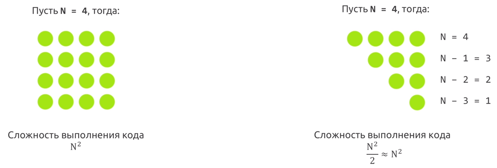

# Подборка алгоритмов, которые правят миром

## Прежде чем начать, зачем мне изучать концепцию Big O?

- Концепцию Big O необходимо понимать, чтобвы видеть и исправлять неоптимальный код.
- Ни один серьезный проект или собеседование не могут обойтись без вопросов о Big O.
- Не понимание Big O ведет к серьезной потери производительности ваших алгоритмов.

## В цель?

- Цель проста — научиться понимать концепцию Big O.

__Big O__ (_в рамках Computer Science_) показывает __верхнюю границу__ зависимости между __входными параметрами__ функции и __количеством опрераций__, которые выполнит процессор. Т.е, показывает зависимость, допустим, между массивом в 1000 элементов и количеством тактов, которое необходимо выполнить процессору, чтобы обработать эти 1000 элементов.

## Вступление, это не относится непосредственно к языку программирования Golang, но почитать или освежить память никому не помешает

### Оценка сложности алгоритмов, или Что такое О(log n)

Сложность алгоритмов обычно оценивают по времени выполнения или по используемой памяти. В обоих случаях сложность зависит от размеров входных данных: массив из 100 элементов будет обработан быстрее, чем аналогичный из 1000. При этом точное время мало кого интересует: оно зависит от процессора, типа данных, языка программирования и множества других параметров. Важна лишь асимптотическая сложность, т. е. сложность при стремлении размера входных данных к бесконечности.

Допустим, некоторому алгоритму нужно выполнить 4n3 + 7n условных операций, чтобы обработать n элементов входных данных. При увеличении n на итоговое время работы будет значительно больше влиять возведение n в куб, чем умножение его на 4 или же прибавление 7n. Тогда говорят, что временная сложность этого алгоритма равна О(n3), т. е. зависит от размера входных данных кубически.

Использование заглавной буквы О (или так называемая О-нотация) пришло из математики, где её применяют для сравнения асимптотического поведения функций. Формально O(f(n)) означает, что время работы алгоритма (или объём занимаемой памяти) растёт в зависимости от объёма входных данных не быстрее, чем некоторая константа, умноженная на f(n).

#### O(1) — константная сложность

Порядок роста O(1) означает, что вычислительная сложность алгоритма не зависит от размера входных данных. Следует помнить, однако, что единица в формуле не значит, что алгоритм выполняется за одну операцию или требует очень мало времени. Он может потребовать и микросекунду, и год. Важно то, что это время не зависит от входных данных.

```go
func GetCount(items []int) int {
    return len(items)
}
```

#### O(n) — линейная сложность

Такой сложностью обладает, например, алгоритм поиска наибольшего элемента в не отсортированном массиве. Нам придётся пройтись по всем n элементам массива, чтобы понять, какой из них максимальный.

Порядок роста O(n) означает, что сложность алгоритма линейно растет с увеличением входного массива. Если линейный алгоритм обрабатывает один элемент пять миллисекунд, то мы можем ожидать, что тысячу элементов он обработает за пять секунд.

Такие алгоритмы легко узнать по наличию цикла по каждому элементу входного массива.

```go
func GetSum(items []int) int {
   sum := 0
   
   for _, item := range items {
      sum += item
   }
   
   return sum
}
```

#### O(log n) — логарифмическая сложность

Порядок роста O( log n) означает, что время выполнения алгоритма растет логарифмически с увеличением размера входного массива. (Прим. пер.: в анализе алгоритмов по умолчанию используется логарифм по основанию 2). Большинство алгоритмов, работающих по принципу «деления пополам», имеют логарифмическую сложность. Метод Contains бинарного дерева поиска (binary search tree) также имеет порядок роста O(log n).

Простейший пример — бинарный поиск. Если массив отсортирован, мы можем проверить, есть ли в нём какое-то конкретное значение, методом деления пополам. Проверим средний элемент, если он больше искомого, то отбросим вторую половину массива — там его точно нет. Если же меньше, то наоборот — отбросим начальную половину. И так будем продолжать делить пополам, в итоге проверим log n элементов.
 
#### O(n^2) — квадратичная сложность

Время работы алгоритма с порядком роста O(n^2) зависит от квадрата размера входного массива. Несмотря на то, что такой ситуации иногда не избежать, квадратичная сложность — повод пересмотреть используемые алгоритмы или структуры данных. Проблема в том, что они плохо масштабируются. Например, если массив из тысячи элементов потребует
1 000 000 операций, массив из миллиона элементов потребует 1 000 000 000 000 операций. Если одна операция требует миллисекунду для выполнения, квадратичный алгоритм будет обрабатывать миллион элементов 32 года. Даже если он будет в сто раз быстрее, работа займет 84 дня.

Такую сложность имеет, например, алгоритм сортировки вставками. В канонической реализации он представляет из себя два вложенных цикла: один, чтобы проходить по всему массиву, а второй, чтобы находить место очередному элементу в уже отсортированной части. Таким образом, количество операций будет зависеть от размера массива как n * n, т. е. n^2.

```go
// не совсем яркий пример: содержит ли вектор (своеобразный массив) A размера n два одинаковых значения

func DuplicateExist(A []int) bool {
    n := len(A)
    
    for i :=0; i < n; i++ {
        for j:= 0 j < n; j++ {
            if i != j && A[i] == A[j] {
                return true
            }
        }
    }

    return false
}

```

Два вложенных цикла дадут нам асимптотику вида f(n) = O(n^2).

__Практическая рекомендация:__ простые программы можно анализировать с помощью подсчёта в них количества вложенных циклов:

- Одиночный цикл в n итераций даёт f(n) = O(n). 
- Цикл внутри цикла — f(n) = O(n^2). 
- Цикл внутри цикла внутри цикла — f(n) = O(n^3). И так далее.

__Практическая рекомендация:__ если у нас имеется серия из последовательных for-циклов, то асимптотическое поведение программы определяет наиболее медленный из них. Два вложенных цикла, идущие за одиночным, асимптотически тоже самое, что и вложенные циклы сами по себе. Говорят, что вложенные циклы доминируют над одиночными.

```go
f(n) = O(n^2)

func Asymptotic() {
    for i := 0; i < N; i ++ {
        // do stuff
    }

    // доминирующая сложность
    for i := 0; i < N; i++ {
        for j := 0; j < N; j++ {
            // do stuff
        } 
    }
}
```

__Примечания:__

- Константы всегда отбрасываются: 2n => O(n), 6n^2 => O(n^2), потому что концепция Big O описывает скорость выполнения алгоритма, стремящийся к бесконочности, 2 бесконечности, 5 бесконечностей — это одна и та же бесконечность.

### Полезные ресурсы

- [Know Thy Complexities!](https://www.bigocheatsheet.com/)

### Что мы измеряем?

При измерении сложности алгоритмов и структур данных мы обычно говорим о двух вещах: количество операций, требуемых для завершения работы (вычислительная сложность), и объем ресурсов, в частности, памяти, который необходим алгоритму (пространственная сложность).

Алгоритм, который выполняется в десять раз быстрее, но использует в десять раз больше места, может вполне подходить для серверной машины с большим объемом памяти. Но на встроенных системах, где количество памяти ограничено, такой алгоритм использовать нельзя.

### Закрепление примерами

__1. Как вы думаете, какая сложность у двух следующих алгоритмов?__

```go
func sum(n int) int {
    if n == 1 {
        return 1
    }
    
    return n + sum(n - 1)
}
```

```go
func pairSumSequence(n int) int {
    sum := 0
    
    for i := 0; i < n; i++ {
        sum += pairSum(i, i + 1)
    }
    
    return sum
}

func pairSum(a, b int) int {
    return a + b
}
```

__Ответ:__ у обеих алгоритмов линейное быстродействие O(n) 

__2. Какой код выполнится быстрее?__

```go
const MaxInt = int(MaxUint >> 1) 
const MinInt = -MaxInt - 1

// Первый
func MaxAndMin(n []int) (int, int) {
    for _, x := range n {
        if x < MinInt {
            min = x
        }
        
        if x > MaxInt {
            max = x
        }
    }
    
    return min, max
}

// второй
func MaxAndMinSecond(n []int) (int, int) {
    for _, x := range n {
        if x < MinInt {
            min = x
        } 
    }
    
    for _, x := range n {
        if x > MaxInt {
            max = x
        }
    }
    
    return min, max
}
```

Логично, что первая 1 цикл и один проход по циклу и действительно, если смотреть на команды процессора второй пример является __медленее__. Но в данном случае это было бы неверно. Концепция Big O показывает как ведут себя эти алгоритмы.

__Ответ:__ у обоих алгоритмов сложность O(n)

__3. Как быть со сложностью O(n^2 + n)?__

Надо понимать как отсеивать неважную сложность:

- N не является константой, следовательно ее нельзя отбросить
- Но мы понимаем, что `O(n^2 + n^2)` == `O(n^2)`
- Так же мы понимаем, что `O(n^2)` > `O(n)`, следовательно если она меньше то не влияет на сложность алгоритма

__Ответ:__ Сложность данного алгоритма O(n^2)

Несколько примеров, чтобы осталось в голове:

- `O(n^2 + n)` мы уже знаем что это `O(n^2)`
- `O(n + log n)` это `O(n)`, т.к. `O(log n)` гораздо меньше `O(n)`
- `O(5 * 2^n + 10 * 2^100)` константы мы помним можно отбрасывать -> `O(2^n * 2^100)` = `O(2^n)`, т.к. экспоненциальное время `O(2^n)` намного больше степенной.
- `O(n^2 + B)` - считаете что `O(n^2)`? На самом деле ответ будет `O(n^2 + B)`, т.к. мы ничего не можем сказать о `B` и мы не можем выбросить ее из нашей сложности.

__4. Откуда берется сложность алгоритма O(log n)?__

Время выполнения log n на примере бинарного поиска, когда берется половина элементов:

- `2^k = N `// 2^4 = 16
- `k = log2 n`
- `O(k) = O(log2 n)`
- `O(k) = O(log n)`, отбрасывае двойку, т.к. мы помним что она является константой и ее можно отбросить

__Ответ:__ для алгоритма, где __на каждой итерации берется половина элементов__ сложность будет включать `O(log n)`, она так же может быть `O(A * log n)` или `O(A + B * log n)`, главное что берется половина элементов.

__5. Какая сложность у следующего алгоритма?__

```go
func foo(n []int) {
    for n-раз
    for n-раз
}
```

__Ответ:__ O(n + n ) = O(n)

__6. Какая сложность у следующего алгоритма?__

```go
func foo(n []int) {
    for n-раз {
        for n-раз {
        
        }
    }
}
```

__Ответ:__ O(n * n) = O(n^2)

__6. Какая сложность у следующего алгоритма?__

```go
func foo(n []int) {
    for i := 0; i < len(n); i++ {
        for j := i; j < len(n); j++ {
            // do stuff
        }
     }
}

// всевдо

func foo(n []int) {
    for n-раз {
        for n, n-1, n-2, n-3, ..., 6, 7 - раз
    }
}
```

- Код внешнего цикла выполняется n-раз
- Код внутреннего цикла выполняется n, n-1, n-2 и т.д. раз
- Тогда сложность можно описать как: `O(n + (n - 1) + (n - 2) + ... + 2 + 1)`, как его упросить?



__Ответ:__ Сложность алгоритма O(n^2)