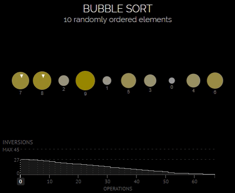

# Пузырьковая сортировка (Bubble sort)

Алгоритм состоит из повторяющихся проходов по сортируемому массиву. 
За каждый проход элементы последовательно сравниваются попарно и, если порядок в паре неверный, выполняется обмен элементов.
Проходы по массиву повторяются N-1 раз или до тех пор, пока на очередном проходе не окажется, что обмены больше не нужны, что означает — массив отсортирован. 
При каждом проходе алгоритма по внутреннему циклу, очередной наибольший элемент массива ставится на своё место в конце массива рядом с предыдущим «наибольшим элементом», а наименьший элемент перемещается на одну позицию к началу массива («всплывает» до нужной позиции, как пузырёк в воде — отсюда и название алгоритма).

Вот шаги для сортировки массива чисел от наименьшего к большему:

- __4 2__ 1 5 3: два первых элемента расположены в массиве в неверном порядке. Меняем их.
- 2 __4 1__ 5 3: вторая пара элементов тоже «не в порядке». Меняем и их.
- 2 1 __4 5__ 3: а эти два элемента в верном порядке (4 < 5), поэтому оставляем как есть.
- 2 1 4 __5 3__: очередная замена.
- 2 1 4 3 5: результат после одной итерации.

Для полной сортировки нужен еще один шаг. Третья итерация пройдет уже без замены. Так вы поймете, что массив отсортирован.

Но причём тут пузырьки? Посмотрите снова на пример, и вы увидите, что алгоритм как бы смещается вправо. По этому поведению элементов в массиве и возникла аналогия с «пузырьками», всплывающими на «поверхность».

## Сложность

| Name                  | Best            | Average             | Worst               | Memory    | Stable    | Comments  |
| --------------------- | :-------------: | :-----------------: | :-----------------: | :-------: | :-------: | :-------- |
| **Bubble sort**       | n               | n<sup>2</sup>       | n<sup>2</sup>       | 1         | Yes       |           |

## Реализация

```go
func BubbleSort(array []int) []int {
	changed := true
	length := len(array)

	// пока есть изменения
	for changed {
		changed = false

		for i := 1; i < length; i++ {
			// если порядок не верный
			if array[i-1] > array[i] {
				// меняем местами элементы
				array[i], array[i-1] = array[i-1], array[i]

				// продолжаем сортировку
				changed = true
			}
		}
	}

	return array
}
```

## Визуализация


