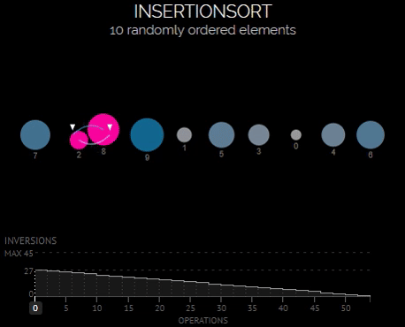

# Сортировка вставками (Insertion sort)

Этот алгоритм разделяет оригинальный массив на сортированный и несортированный подмассивы.

Длина сортированной части равна 1 в начале и соответствует первому (левому) элементу в массиве. 
После этого остается итерировать массив и расширять отсортированную часть массива одним элементом с каждой новой итерацией.

После расширения новый элемент помещается на свое место в отсортированном подмассиве. 
Это происходит путём сдвига всех элементов вправо, пока не встретится элемент, который не нужно двигать.

В приведенном ниже массиве жирная часть отсортирована в порядке возрастания. Посмотрите что произойдет в этом случае:

- __3 5 7 8__ 4 2 1 9 6: выбираем 4 и помним, что это элемент, который нужно вставить. __8 > 4__, поэтому сдвигаем.
- __3 5 7 x 8__ 2 1 9 6: здесь x – нерешающее значение, так как элемент будет перезаписан (на 4, если это подходящее место, или на 7, если смещение). __7 > 4__, поэтому сдвигаемся.
- __3 5 x 7 8__ 2 1 9 6
- __3 x 5 7 8__ 2 1 9 6
- __3 4 5 7 8__ 2 1 9 6

Теперь вы видите, что отсортированная часть дополнилась элементом. Каждая следующая итерация делает то же самое, и к концу вы получите отсортированный массив!

## Сложность

| Name                  | Best            | Average             | Worst               | Memory    | Stable    | Comments  |
| --------------------- | :-------------: | :-----------------: | :-----------------: | :-------: | :-------: | :-------- |
| **Insertion sort**    | n               | n<sup>2</sup>       | n<sup>2</sup>       | 1         | Yes       |           |

## Реализация

```go
func InsertionSort(array []int) []int {
	length := len(array)

	for i := 1; i < length; i++ {
		j := i

		for j > 0 {
			if array[j-1] > array[j] {
				array[j-1], array[j] = array[j], array[j-1]
			}
			j = j - 1
		}
	}

	return array
}
```

## Визуализация

